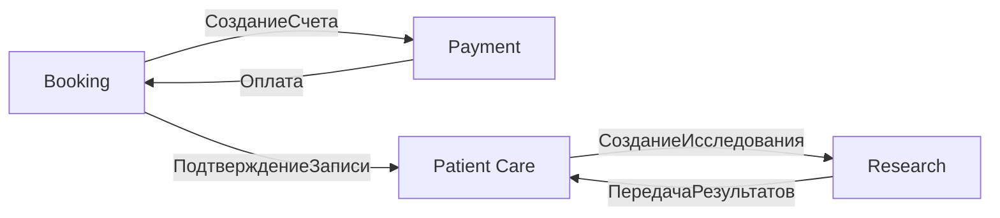

# Каталог доменных и интеграционных событий

## 1. Booking (источник записи на визит)

### Внутренние (domain events)

| Событие | Семантика | Минимальный контракт |
|---------|-----------|----------------------|
| `СозданаЗаписьНаВизит` | Пациент записан на слот | `bookingId`, `patientId`, `slotAt`, `clinicId` |
| `ВыставленСчетНаОплатуВизита` | Booking инициировал оплату | `bookingId`, `invoiceId`, `amount`, `currency` |
| `ЗаписьПодтверждена` | Запись активна для клиники | `bookingId`, `patientId`, `confirmedAt` |

### Публикует (integration)

| Событие | Подписчики | Контракт |
|---------|------------|----------|
| `СозданиеСчета` | **Payment** | `invoiceId`, `bookingId`, `amount`, `currency`, `dueAt` |
| `ПодтверждениеЗаписи` | **Patient Care** | `bookingId`, `patientId`, `scheduledAt`, `clinicId` |

### Подписывается

| Событие | Источник | Действие |
|---------|----------|----------|
| `Оплата` | **Payment** | Команда «Подтвердить запись» → `ЗаписьПодтверждена` |

---

## 2. Payment (источник финансовой транзакции)

### Внутренние

| Событие | Семантика | Минимальный контракт |
|---------|-----------|----------------------|
| `СчетОплачен` | Платёж прошёл | `invoiceId`, `paymentId`, `paidAt`, `amount` |

### Публикует (integration)

| Событие | Подписчики | Контракт |
|---------|------------|----------|
| `Оплата` | **Booking** | `invoiceId`, `bookingId`, `paymentId`, `paidAt` |

*Опционально в целевой архитектуре:* подписчик **Analytics** (агрегаты выручки, без PHI).

### Подписывается

| Событие | Источник |
|---------|----------|
| `СозданиеСчета` | **Booking** |

---

## 3. Patient Care (источник клинического процесса)

### Внутренние

| Событие | Семантика | Минимальный контракт |
|---------|-----------|----------------------|
| `ВизитНачат` | Приём открыт | `visitId`, `bookingId`, `patientId`, `startedAt` |
| `СобраныДанные` | Опрос/анамнез зафиксирован | `visitId`, `patientId` |
| `УстановленДиагноз` | Диагноз зафиксирован | `visitId`, `diagnosisCode`, `recordedAt` |
| `НазначеноЛечение` | План лечения создан | `visitId`, `treatmentPlanId` |
| `ЛечениеСкорректировано` | План изменён после контроля | `visitId`, `treatmentPlanId`, `version` |
| `УстановленРезультатЛечения` | Исход лечения зафиксирован | `visitId`, `outcome` |
| `НазначеноИсследование` | Заказ диагностики | `visitId`, `researchOrderId`, `testType` |
| `ВизитЗавершен` | Приём закрыт | `visitId`, `completedAt` |

### Публикует (integration)

| Событие | Подписчики | Контракт |
|---------|------------|----------|
| `СозданиеИсследования` | **Research** | `researchOrderId`, `visitId`, `patientId`, `testType`, `priority` |
| `ПередачаРезультатов` | *(входящее от Research, см. ниже)* | — |

### Подписывается

| Событие | Источник | Действие |
|---------|----------|----------|
| `ПодтверждениеЗаписи` | **Booking** | «Начать визит» (по расписанию/приходу пациента) |
| `ПередачаРезультатов` | **Research** | «Ознакомиться с результатами» → обновление истории болезни |

---

## 4. Research (источник диагностики и ИИ)

### Внутренние

| Событие | Семантика | Минимальный контракт |
|---------|-----------|----------------------|
| `СобраныДанныеМатериала` | Образец/данные приняты | `materialId`, `researchOrderId` |
| `МатериалОтправленВЛабораторию` | Логистика в лабораторию | `materialId`, `sentAt` |
| `МатериалПолученЛабораторией` | Лаборатория приняла образец | `materialId`, `receivedAt` |
| `ПроведеноИсследованиеМатериала` | Анализ/снимок готов | `materialId`, `researchOrderId`, `completedAt` |

*Расширение под «Будущее 2.0»:* `ПройденоИсследованиеИИ` — результат ML-модели (отдельное поле `aiInsightId`, без утечки сырого снимка в интеграционное событие).

### Публикует (integration)

| Событие | Подписчики | Контракт |
|---------|------------|----------|
| `ПередачаРезультатов` | **Patient Care** | `researchOrderId`, `visitId`, `patientId`, `resultSummary`, `resultRef` (S3/artifactId), `completedAt` |

### Подписывается

| Событие | Источник |
|---------|----------|
| `СозданиеИсследования` | **Patient Care** |

---

## 5. Сводка: кто источник / кто подписчик

| Integration event | Источник | Подписчики |
|-------------------|----------|------------|
| `СозданиеСчета` | Booking | Payment |
| `Оплата` | Payment | Booking |
| `ПодтверждениеЗаписи` | Booking | Patient Care |
| `СозданиеИсследования` | Patient Care | Research |
| `ПередачаРезультатов` | Research | Patient Care |

---

## 6. Технические соглашения (пилот)

- Транспорт: **Apache Kafka**, версионирование через **Schema Registry**.
- Именование топиков: `future20.<bc>.<event>.v1` (например `future20.booking.ПодтверждениеЗаписи.v1`).
- Идемпотентность: обязательный `eventId` + бизнес-ключ (`bookingId`, `invoiceId`, …).
- PHI/ПДн: в интеграционных событиях — только идентификаторы и ссылки на артефакты; полные медданные — внутри BC через ABAC.
