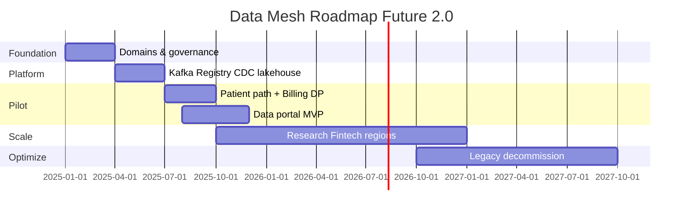

# Roadmap Data Mesh — Future 2.0

Стратегический план внедрения **Data Mesh** и платформы данных на **36 месяцев**, согласованный с:

- бизнес-целями [task.log](../task.log);
- событийной моделью [Task4Advanced](../Task4Advanced/events.md) (Booking, Payment, Patient Care, Research);
- целевой архитектурой [To-Be](../Task3Advanced/ToBe.png);
- технологическим радаром [tech-radar.md](tech-radar.md).

---

## Целевые бизнес-цели

| # | Цель | KPI (пример) |
|---|------|----------------|
| B1 | Ускорить запуск финтех- и медсервисов | Time-to-market нового продукта −40% к Y3 |
| B2 | Независимость доменов при единых KPI | 100% новых интеграций — через события/data contracts |
| B3 | Сократить время подготовки отчётности | Сложный отчёт: с часов → до минут (self-service) |
| B4 | Near-real-time и новые регионы | Streaming marts; 2–3 региона (США/ЕС/РФ) к Y3 |
| B5 | Безопасная витрина без медкарт | 0 PHI в data portal; audit DPO |

---

## Ключевые роли

| Роль | Ответственность | Взаимодействие |
|------|-----------------|----------------|
| **Data Product Owner (DPO)** | Ценность data product, SLA, потребители, политика публикации | Домен + головной офис |
| **Data Engineer** | Ingestion, CDC, Airflow, качество, публикация в lakehouse | Platform team |
| **Analytics Engineer** | dbt, semantic layer, тесты, документация | DPO + BI |
| **BI-аналитик** | Дашборды, self-service сценарии, Power BI → portal | Бизнес-пользователи |
| **Domain Architect** | BC, события, ADR, ACL к legacy | Architecture Board |
| **Platform Engineer** | Kafka, Schema Registry, K8s, Terraform, MinIO/S3 | SRE |
| **Security / Data Governance Lead** | Atlas, Ranger, ABAC-политики, классификация, lineage | DPO + Legal |
| **SRE** | SLO, runbooks, Prometheus/Grafana, инциденты Kafka | Platform |

### RACI (упрощённо)

| Активность | DPO | Data Eng. | Analytics Eng. | Platform | Governance |
|------------|-----|----------|----------------|----------|------------|
| Определение data product | A | R | C | I | C |
| Публикация в каталог | A | R | C | C | A |
| Semantic metrics | C | C | A/R | I | C |
| Kafka topic / schema | I | C | I | A/R | C |

*A — accountable, R — responsible, C — consulted, I — informed*

---

## Этапы внедрения

| Период | Этап | Основные действия | Технологии (из радара) | Бизнес-цели |
|--------|------|-------------------|------------------------|-------------|
| **0–3 мес.** | **Foundation** | Домены и BC; data classification; правила data products; KPI de-legacy; Architecture Board | ADR, DDD, Atlas (design) | B2 |
| **3–6 мес.** | **Platform MVP** | Kafka, Schema Registry, Debezium CDC, lakehouse (MinIO/S3), Airflow, OTel, Keycloak; DLQ, каталог схем | Adopt: Kafka, Debezium, Postgres, Vault | B2, B4 |
| **6–9 мес.** | **Pilot domains** | Пилот: **Путь пациента** (Booking + Patient Care) и **Биллинг** (Payment); 3–5 data products; MVP data portal (ограниченный круг); события из [events.md](../Task4Advanced/events.md) | Trial: Data Mesh, dbt, React portal | B1, B3, B5 |
| **9–15 мес.** | **Expand critical flows** | Research BC, операторский UI (React); streaming marts (Kafka Streams Trial); ACL Camel/DWH; semantic layer v1; Power BI на semantic layer | Trial: Kafka Streams, Power BI | B3, B4 |
| **15–24 мес.** | **Mesh scaling** | DPO в каждом домене; фарма + medtech через Partner Gateway; FinTech data products; Ranger; региональные контуры данных | Trial: Ranger, Zero Trust | B1, B4 |
| **24–36 мес.** | **Run & optimize** | Снижение DWH/Camel; FinOps; adoption self-service; near-real-time витрины; HOLD → decommission SQL 2008, PowerBuilder | Adopt: domain analytics | B1–B5, TCO |

---

## Детализация по фазам

### Пилот (6–9 мес.)

**Домены**

1. **Booking + Payment** — data products: `appointments_daily`, `revenue_by_clinic`, `payment_success_rate`.
2. **Patient Care** (без PHI в витрине) — `visit_duration`, `diagnosis_categories_aggregate`.

**Критерии готовности пилота**

- [ ] У каждого data product есть DPO, SLA, entry в Atlas.
- [ ] Lineage (OpenLineage) от Kafka → Airflow → serving.
- [ ] 20+ бизнес-пользователей на portal MVP.
- [ ] Нет прямых запросов к DWH для этих метрик.

**Команда**

- Platform: 4–6 FTE (Kafka, Airflow, SRE).
- Пилотные домены: по 1 DPO + 1 Data Engineer.

### Масштабирование (9–24 мес.)

- Подключение доменов только при наличии **минимального data contract**.
- BI работает через **semantic layer**, не raw lakehouse.
- Research: data product `diagnostics_turnaround` (без сырых снимков).
- Банк (legacy): CDC → события → ACL; не расширять Camel.

### Поддержка (24–36 мес.)

| Практика | Частота |
|----------|---------|
| Data Product Review (usage, SLA, cost) | Ежемесячно |
| Architecture compliance (anti-corruption, Hold-tech) | На major release |
| FinOps review (облако, Kafka storage) | Ежеквартально |
| DPO council | Ежеквартально |

---

## Связь с событийной архитектурой (Task4)

| Integration event | Data product (пример) | Домен-владелец |
|-------------------|----------------------|----------------|
| `ПодтверждениеЗаписи` | Загрузка клиник по слотам | Booking |
| `Оплата` | Выручка, конверсия оплаты | Payment |
| `ВизитЗавершен` | Длительность приёма, throughput | Patient Care |
| `ПередачаРезультатов` | TAT лаборатории (агрегат) | Research |

Операционные системы обмениваются **событиями**; аналитика потребляет **материализованные data products**, а не OLTP-таблицы соседнего BC.

---

## Дорожная карта (диаграмма Ганта, упрощённо)

*Даты условные; сдвинуть от фактической даты старта программы.*

---

## Риски roadmap (связь с Task3)

| Риск | Митигация в roadmap |
|------|---------------------|
| Нет DPO в домене | Подключение домена только после назначения DPO |
| Утечка PHI в витрину | Governance gate + Anonymizer до публикации |
| Затягивание DWH | Явный milestone decommission 24–36 мес. |
| Перегрузка platform team | Ограничить пилот 2 доменами до 9 мес. |

Подробнее: [risk-map.md](../Task3Advanced/risk-map.md), [risk-management-plan.md](../Task3Advanced/risk-management-plan.md).

---

## Ожидаемые результаты к 36 месяцу

- **8–12** production data products с SLA и lineage.
- **Self-service portal** — основной канал отчётности для доменов.
- **>80%** междоменных интеграций через Kafka (не DWH/Camel).
- **DWH SQL 2008** и **PowerBuilder** — выведены из эксплуатации или <5% трафика.
- **TCO run-rate** — см. [tco-analysis.md](tco-analysis.md) (цель −32% к Y3 vs As-Is).
